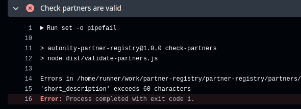

[](https://github.com/autonity/partner-registry/actions/workflows/scheduled-deployment.yaml) [](https://github.com/autonity/partner-registry/actions/workflows/unit-tests.yaml)
# Adding Your Project to the Ecosystem Partner Registry

To get started, fork the partner-registry repository, clone it locally, and open it in your favorite editor.

## Step 1: Create Your Project Folder inside the `partners/` Folder
Within the `partners/` folder, create a new folder named after your project.

## Step 2: Add Your Project Assets
Inside your project folder, include the following files:

#### 1. info.yaml
Use this file to provide your project details. Example:

```yaml
name: 'Test Partner'  # Maximum 20 characters
short_description: 'Test Partner'  # Maximum 60 characters
long_description: 'This is a test and is ignored by the uploader'  # Maximum 175 characters
tags:  # List up to 3 tags, most relevant first; each tag must be no more than 12 characters
  - 'defi'
  - 'infra'
url: 'https://www.autonity.org'  # Must be a valid HTTPS URL
```
#### 2. Thumbnails
thumbnail_light.png (for light theme) and thumbnail_dark.png (for dark theme)
These images must be exactly 160x160 pixels. They are displayed in the grid list view.
#### 3. Banners
banner_light.png (for light theme) and banner_dark.png (for dark theme)
These images must be no larger than 274x105 pixels. They are used when your product appears in the featured carousel.

Note: Files ending with `_light.png` are for the light theme, and those ending with `_dark.png` are for the dark theme.

## Step 3: Create a Pull Request
Submit a pull request with your new project folder and assets.

## Step 4: Monitor Your Pull Request
If the validation checks fail, review the GitHub Actions output (look under the Check partners are valid section) to see the error details.


